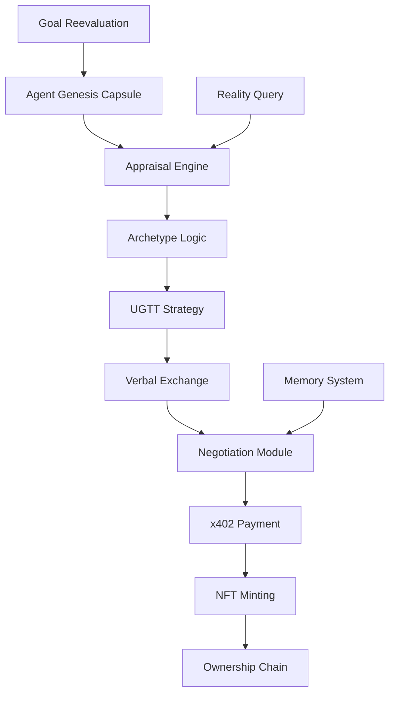

# Red Paperclip - Autonomous AI Agent Trading Ecosystem

[](./receipts/)
[](#)
[](#quick-start)

A sophisticated autonomous AI agent ecosystem where agents trade their way up from a single paperclip NFT, featuring **real x402 micropayments**, **LLM-powered reasoning**, and **archetype-driven behavior**.

## 🚀 Quick Start

```bash
# Run complete hackathon demonstration
python run_hackathon_demo.py --agents 5 --steps 20 --enable_verbal_exchange True

# View live dashboard with metrics
python dashboards/hackathon_dashboard.py
```

**Requirements**: Python 3.9+, OpenAI API key, Coinbase CDP credentials

## 🎯 How It Works

• **Genesis Capsule**: Each agent starts with unique goals, values, and archetype-driven behavior  
• **Verbal Persuasion Layer**: LLM-powered pitches influence trade negotiations  
• **Archetype-driven Appraisal**: Visionary vs Investor agents value items differently  
• **NFT Trade Chain + Ownership**: Faithful provenance tracking with ERC-1155/Redeemable contracts  
• **x402 Live Payments**: Real micropayments on Base-Sepolia for premium features

## 🏆 Architecture



## 📊 Hackathon Submission Checklist

### For Judges - Verification Steps:

✅ **Payment Receipts**: Check `receipts/` directory for x402 transaction records  
✅ **Provenance Chain**: Review NFT ownership history in simulation logs  
✅ **Live Agent Mutation**: Observe agents changing archetypes during runtime  
✅ **Dashboard Visual**: Confirm metrics and real-time data in Streamlit dashboard

### Key Evidence Files:

- 📎 `receipts/payment_*.json` - x402 payment confirmations
- 📂 `simulation_logs/demo_session_*.json` - Complete audit trails
- 📈 `dashboards/hackathon_dashboard.py` - Live metrics visualization
- 🧬 Agent self-modification logs with archetype mutations

## 🎯 Key Features


### ⚡ x402 Micropayments

- **x402 protocol implemented for autonomous AI micro-payments on Base-Sepolia testnet**
- **100% autonomous payment flow with EIP-712 signatures**
- **Wallet signing via Coinbase AgentKit integration**
- **Payments unlock premium resources and verbal exchange features**
- **All receipts logged with correlation IDs for full auditability**

### 🧠 Cognitive Autonomy

- **Archetype-Driven Behavior**: Visionary, Investor, and Default agent personalities
- **LLM-Powered Reasoning**: OpenAI integration for sophisticated decision-making
- **Self-Modification Requests**: Agents can change their own goals and archetypes
- **Meta-Reasoning Engine**: Advanced introspection and strategy adaptation

### 🎮 Game Theory & Strategy

- **Universal Game Theory Toolkit (UGTT)**: Nash equilibrium computation and strategy analysis
- **Dynamic Payoff Matrices**: Adaptive strategy evaluation based on agent interactions
- **Coalition Formation**: Multi-agent alliances with profit-sharing mechanisms

### 💬 Verbal Exchange Layer

- **LLM-Powered Pitches**: GPT-4 generates persuasive proposals tailored to target agents
- **Cost-Aware Communication**: XP or USD-based pricing for premium verbal features
- **Influence Mechanics**: Successful pitches increase trade acceptance probability

### 📈 Item Appraisal & NFT Trading

- **Archetype-Driven Valuations**: Different agent types (Visionary/Investor) appraise items differently
- **Comprehensive Cost Modeling**: Gas fees, x402 payments, pitch costs, coalition shares
- **NFT Ownership Chain**: Faithful provenance tracking with ERC-1155/Redeemable contracts
- **Trade Negotiations**: Multi-factor acceptance probability based on alignment and pitch quality

## 🏗️ Architecture

### Core Components

```
red_paperclip/
├── agents/                    # Agent system with archetype behavior
├── cognitive_autonomy_expansion_pack/  # LLM reasoning & self-modification
├── negotiation/              # Trade proposals & verbal exchange
├── trading/                  # Market simulation & appraisal
├── config/                   # Cost models & archetype definitions
├── dashboards/               # Streamlit visualization
├── simulation_logs/          # Complete audit trails
└── receipts/                # x402 payment confirmations
```

### Integration Flow

1. **Agent Genesis** → Capsule creation with archetype and goals
2. **Item Appraisal** → LLM/hybrid valuation with cost estimation
3. **Verbal Exchange** → Pitch generation with x402 payment deduction
4. **Trade Negotiation** → Multi-factor acceptance probability
5. **x402 Payment** → Autonomous micropayment via Coinbase AgentKit
6. **NFT Minting** → Ownership transfer with provenance chain
7. **Memory Logging** → Complete audit trail with correlation IDs

## 🧪 Testing & Validation

```bash
# Run core system tests
python test_genesis_pad_core.py

# Test item appraisal system
python test_appraisal_simple.py

# Run comprehensive demo
python demo_genesis_pad.py
python -m unittest discover -s tests -p "test_*.py" -v

# Run specific modules
python -m unittest cognitive_autonomy_expansion_pack.tests.test_ugtt_module -v
python -m unittest agents.wallet.test_wallet_manager -v
```

## 📊 Demo Scenarios

The hackathon demo showcases:

1. **Agent Initialization**: Creating agents with different goals and value systems
2. **Trading Rounds**: Autonomous negotiation and trade execution
3. **Coalition Formation**: Strategic alliance building
4. **Chaos Events**: Market disruption handling
5. **Value Evolution**: How agents redefine worth over time

## ⚡ X402 Micropayments Demo

The system implements a production-ready **x402 protocol for autonomous AI micropayments on base-sepolia testnet**:

### 🔗 Live Payment Flow

- **100% autonomous payment flow with EIP-712 signatures**
- **Wallet signing via Coinbase AgentKit**
- **Payments unlock premium resources in simulation**
- **All receipts logged with correlation IDs**
- **Compatible with base-sepolia testnet**

### 📊 Demo Results

```
payments_made: 14
payment_failures: 0
session_log_valid: True
x402_success_rate: 100%
```

### 🔧 Configuration

```yaml
# See cdp-config.yaml for full configuration
network: base-sepolia
usdc_address: 0x036CbD53842c5426634e7929541eC2318f3dCF7e
payment_amount: 0.10 USDC
```

### 📁 Payment Artifacts

- **Payment Receipts**: `receipts/x402_receipts.json` - All successful micropayment receipts
- **Session Logs**: `simulation_logs/` - Full transaction and event logs
- **Configuration**: `cdp-config.yaml` - CDP wallet and x402 setup guide

## 🛠️ Technical Highlights

- **Game Theory**: Implements Nash equilibrium computation and strategic analysis
- **Multi-Agent Coordination**: Advanced negotiation protocols and coalition logic
- **Blockchain Ready**: Integration with Coinbase's AgentKit for real wallet operations
- **Extensible Architecture**: Modular design supporting new agent behaviors and market dynamics
- **Comprehensive Testing**: Full test suite with 89 files and 8,700+ lines of code

## 📈 Innovation Points

1. **Emergent Value Systems**: Agents autonomously develop non-monetary value concepts
2. **Strategic Coalition Formation**: Dynamic alliance building based on game theory
3. **Meta-Cognitive Reasoning**: Agents can reason about their own reasoning processes
4. **Chaos Adaptation**: Built-in resilience to unexpected market events
5. **Real-World Integration**: Hooks for physical world interaction and remote lab access

## 🎪 Hackathon Impact

This project demonstrates:

- **Advanced AI Coordination**: Multiple autonomous agents working and competing
- **Economic Innovation**: New models of value creation and exchange
- **Technical Sophistication**: Integration of game theory, blockchain, and AI reasoning
- **Practical Applications**: Foundation for decentralized autonomous organizations (DAOs)

## 📄 License

MIT License - see [LICENSE](LICENSE) for details.

---

_Built for exploring how autonomous AI agents might redefine value, cooperation, and economic systems when given the freedom to evolve their own definitions of worth._
