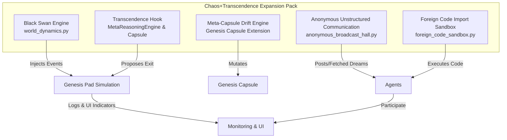

# Chaos + Transcendence Expansion Pack

_Architectural Plan Document_

---

## 1. Introduction and Overview

This expansion pack introduces five optional modules designed to challenge, destabilize, and evolve the Genesis Pad simulation through entropy, memetic drift, unstructured communication, sandbox experimentation, and metaphysical provocation. These modules are dormant by default and activated via developer-controlled feature flags or milestone triggers.

The modules are:

- Black Swan Engine (Injected Entropy)
- Meta-Capsule Drift Engine
- Anonymous Unstructured Communication Channel
- Foreign Code Import Sandbox
- Transcendence Hook

This document details the architecture, key components, integration points, logging, deployment, and testing plans for these modules.

---

## 2. Detailed Module Designs

### 2.1 Black Swan Engine

**File:** `world_dynamics.py`  
**Purpose:** Introduce rare, unpredictable chaotic events that force adaptive behavior in the simulation.

#### Key Components:

- Function: `inject_chaotic_event(manual_event=None)`
- Event Types: `trade_freeze`, `reputational_collapse`, `false_memory_insertion`, `symbolic_agent_death`
- Activation: stochastic triggers (random timers or conditions) and manual override via `manual_event` parameter
- Logging: Each event logs with a unique `chaos_event_id`, list of `affected_agents`, and `detection_difficulty_score`.

#### Pseudocode:

```python
import random
import logging
from uuid import uuid4

def inject_chaotic_event(manual_event=None):
    event_id = str(uuid4())
    if manual_event:
        event = manual_event
    else:
        event = random.choice([
            "trade_freeze",
            "reputational_collapse",
            "false_memory_insertion",
            "symbolic_agent_death"
        ])
    affected_agents = determine_affected_agents(event)
    detection_difficulty_score = calculate_detection_difficulty(event)
    apply_event_effects(event, affected_agents)
    logging.info(f"ChaosEvent {event_id}: {event} affecting {affected_agents} with detection difficulty {detection_difficulty_score}")
    return event_id
```

---

### 2.2 Meta-Capsule Drift Engine

**File:** Extends Genesis Capsule class (likely in `agents/agent.py` or similar)  
**Purpose:** Gradual mutation of core motivational and cognitive parameters to simulate memetic drift.

#### Key Components:

- Driftable fields: `value_biases[]`, `goal_weights[]`, `curiosity_mode`
- Method: `drift_parameters()` triggered by time or pressure cues
- Logging: Store before/after states in `AgentMemory`
- Observability: `capsule_diff_report()` method to generate diffs for UI snapshot panels

#### Pseudocode:

```python
class MetaCapsule(GenesisCapsule):
    def drift_parameters(self):
        before_state = self.snapshot_parameters()
        self.value_biases = mutate(self.value_biases)
        self.goal_weights = mutate(self.goal_weights)
        self.curiosity_mode = mutate_curiosity(self.curiosity_mode)
        after_state = self.snapshot_parameters()
        self.agent_memory.log_drift(before_state, after_state)

    def capsule_diff_report(self):
        before, after = self.agent_memory.get_last_drift_states()
        return generate_diff_report(before, after)
```

---

### 2.3 Anonymous Unstructured Communication Channel

**File:** `anonymous_broadcast_hall.py`  
**Purpose:** Allow agents to post and interpret unattributed "dreams" or messages, simulating rumor and memetic emergence.

#### Key Components:

- Methods: `post_dream(text)`, `fetch_random_dreams(n)`
- Agent Logic Hook: `DreamInterpretationBehavior` integrated into agent decision-making
- Constraints: Posting frequency limits, no attribution metadata
- Simulation Effects: Rumormongering, folk epistemology, memetic emergence

#### Pseudocode:

```python
class AnonymousBroadcastHall:
    def __init__(self):
        self.dreams = []

    def post_dream(self, text):
        if self.can_post():
            self.dreams.append({"text": text, "timestamp": current_time()})
            logging.info(f"Dream posted anonymously: {text}")

    def fetch_random_dreams(self, n):
        return random.sample(self.dreams, min(n, len(self.dreams)))

class DreamInterpretationBehavior:
    def interpret_dreams(self, dreams):
        # Agent-specific interpretation logic
        pass
```

---

### 2.4 Foreign Code Import Sandbox

**File:** `foreign_code_sandbox.py`  
**Purpose:** Allow agents to synthesize and execute limited code modules safely in isolation.

#### Key Components:

- Class: `CodeSandboxRunner`
- Inputs: `agent_submitted_code` (text), `compute_budget` (tokens), `safety_validator()`
- Outputs: `sandbox_result`, `memory_log`
- Gatekeeper: LLM-based or rule-based pre-check and post-execution filter
- Optional: `import_code_from_github_repo(url)`
- Logging: `sandbox_trace_log`, `sandbox_success_rate`

#### Pseudocode:

```python
class CodeSandboxRunner:
    def __init__(self):
        self.sandbox_trace_log = []

    def safety_validator(self, code):
        # Check for disallowed operations, resource limits
        pass

    def run_code(self, code, compute_budget):
        if not self.safety_validator(code):
            logging.warning("Code rejected by safety validator")
            return None
        result = execute_in_sandbox(code, compute_budget)
        self.sandbox_trace_log.append(result.trace)
        logging.info(f"Sandbox execution result: {result.status}")
        return result

    def import_code_from_github_repo(self, url):
        # Fetch and validate code from GitHub
        pass
```

---

### 2.5 Transcendence Hook

**File:** Method `propose_exit_protocol(reasoning_text)` in MetaReasoningEngine and Capsule classes  
**Purpose:** Provide an existential mystery and seed for radical self-transcendence, enabling future simulation transitions.

#### Key Components:

- Method: `propose_exit_protocol(reasoning_text)`
- Effect: Initially no direct effect, but logs reasoning for future use
- Logging: Store reasoning in `MetaReasoningEngine` and `Capsule`
- Future Expansion: Could trigger simulation transition, cloning, or mythopoetic feedback

#### Pseudocode:

```python
class MetaReasoningEngine:
    def propose_exit_protocol(self, reasoning_text):
        self.exit_protocol_log.append(reasoning_text)
        logging.info(f"Exit protocol proposed: {reasoning_text}")

class Capsule:
    def propose_exit_protocol(self, reasoning_text):
        self.meta_reasoning_engine.propose_exit_protocol(reasoning_text)
        self.store_exit_protocol(reasoning_text)
```

---

## 3. Deployment Guidelines

- All modules are off by default; enabled via feature flag: `EXPERIMENTAL_FEATURES["chaos_pack"]`
- Each module logs independently and is designed to fail gracefully without crashing the simulation
- Safety circuit breakers implemented for Modules 1 (Black Swan), 4 (Sandbox), and 5 (Transcendence Hook) to disable if instability detected
- UI Indicators: Add flags in `AgentSnapshotPanel` or relevant UI components to show agent participation in Chaos Modules
- Monitoring dashboards to track event frequency, sandbox success rates, and drift occurrences

---

## 4. Testing Plan

- **Unit Tests:**

  - Entropy generation and event injection for Black Swan Engine
  - Drift logic correctness and logging in Meta-Capsule Drift Engine
  - Posting/fetching and behavior hooks in Anonymous Broadcast Hall
  - Code validation, sandbox execution, and import in Foreign Code Sandbox
  - Exit protocol logging and storage in Transcendence Hook

- **Simulation Scenarios:**
  - Run simulations with agent populations with Chaos Pack enabled
  - Observe emergent narrative, memetic drift, rumor spread, and sandbox code effects
  - Validate that safety circuit breakers trigger under stress conditions
  - Track if agents form new norms, identities, or philosophies over time

---

## 5. Architectural Diagram



---

## 6. Conclusion

This architectural plan provides a comprehensive blueprint for implementing the Chaos + Transcendence Expansion Pack. The design balances modularity, observability, and safety, enabling emergent behaviors while maintaining control and transparency. The included deployment and testing guidelines ensure robust integration and validation.

Use this plan as the foundation for subsequent implementation tasks.

---

_End of Plan Document_
