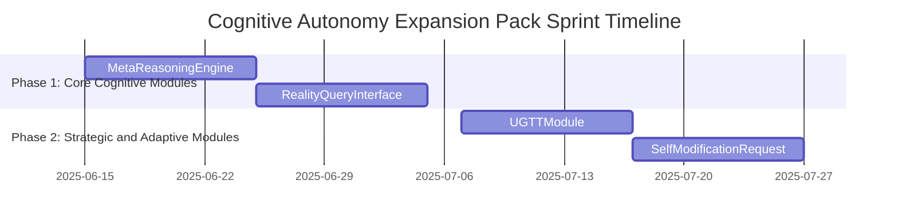

# Cognitive Autonomy Expansion Pack Sprint Plan for Genesis Pad Simulation

## Overview

This sprint aims to extend the autonomy capabilities of trading agents by introducing advanced cognitive modules that enable meta-reasoning, universal game theory analysis, reality querying, and self-modification requests. These modules build upon the Foundations to Autonomy sprint, enhancing agent decision-making, adaptability, and self-awareness in complex environments.

The work is organized into four new modular components, each designed for testability and integration with existing Genesis Pad systems. The sprint includes a phased rollout plan with clear dependencies and a comprehensive testing strategy.

---

## Modules and Integration Points

### 1. MetaReasoningEngine

- **Purpose:** Enable agents to perform meta-level reasoning about their own cognitive processes, decisions, and strategies.
- **Key Components:**
  - `MetaReasoningEngine` class to analyze agent reasoning logs and suggest improvements.
  - Methods for introspection, hypothesis generation, and reasoning pattern recognition.
  - Interfaces with AgentMemory for accessing reasoning history.
- **Integration:** Connects with AgentMemory for data; interfaces with Goal Reevaluation Module for feedback loops.
- **Dependencies:** AgentMemory, Goal Reevaluation Module.
- **Testing:** Unit tests for reasoning algorithms; integration tests with memory and goal modules.

### 2. UGTTModule (Universal Game Theory Toolkit)

- **Purpose:** Provide universal game theory tools for strategic decision-making in multi-agent environments.
- **Key Components:**
  - `UGTTModule` class implementing game theory models (e.g., Nash equilibrium, cooperative games).
  - Methods for payoff matrix construction, strategy evaluation, and equilibrium computation.
  - Simulation hooks for testing game scenarios.
- **Integration:** Interfaces with trading logic and agent decision modules.
- **Dependencies:** Trading modules, Agent decision framework.
- **Testing:** Unit tests for game theory computations; simulation tests for multi-agent interactions.

### 3. RealityQueryInterface

- **Purpose:** Allow agents to query and interpret external reality data sources to inform decisions.
- **Key Components:**
  - `RealityQueryInterface` class to fetch and parse real-world data (market data, news, events).
  - Methods for data normalization, filtering, and relevance scoring.
  - Plug-in architecture for adding new data sources.
- **Integration:** Connects with trading logic and agent memory for contextual awareness.
- **Dependencies:** Trading modules, AgentMemory.
- **Testing:** Unit tests for data fetching and parsing; integration tests with trading logic.

### 4. SelfModificationRequest

- **Purpose:** Enable agents to request and manage self-modifications to their own code or parameters based on meta-reasoning outputs.
- **Key Components:**
  - `SelfModificationRequest` class to encapsulate modification proposals.
  - Methods for validation, approval workflow, and execution hooks.
  - Logging and audit trail for modifications.
- **Integration:** Interfaces with MetaReasoningEngine and agent lifecycle management.
- **Dependencies:** MetaReasoningEngine, Agent lifecycle components.
- **Testing:** Unit tests for request lifecycle; integration tests with meta-reasoning and agent management.

---

## Modular File Structure

```
cognitive_autonomy_expansion_pack/
├── meta_reasoning_engine.py
├── ugtt_module.py
├── reality_query_interface.py
├── self_modification_request.py
├── tests/
│   ├── test_meta_reasoning_engine.py
│   ├── test_ugtt_module.py
│   ├── test_reality_query_interface.py
│   └── test_self_modification_request.py
```

---

## Integration Points and Dependencies

- `MetaReasoningEngine` depends on `AgentMemory` for reasoning logs and feeds insights to the `Goal Reevaluation Module`.
- `UGTTModule` integrates with existing trading logic and agent decision-making frameworks to enhance strategic reasoning.
- `RealityQueryInterface` connects to external data sources and feeds processed data into trading logic and agent memory.
- `SelfModificationRequest` works closely with `MetaReasoningEngine` outputs and agent lifecycle management to enable adaptive self-improvement.

---

## Testing Strategy

- **Unit Tests:** Each module will have comprehensive unit tests covering core functionality and edge cases.
- **Integration Tests:** Verify data flow and interaction between new modules and existing components (e.g., memory, trading logic).
- **Simulation Tests:** Multi-agent simulations to test UGTTModule strategies and RealityQueryInterface data impact.
- **Continuous Integration:** Automated test runs on each commit to ensure stability and regression prevention.

---

## Phased Execution Timeline

### Phase 1: Core Cognitive Modules (Weeks 1-3)

- Develop MetaReasoningEngine and RealityQueryInterface modules.
- Establish integration with AgentMemory and trading logic.
- Initial unit and integration testing.

### Phase 2: Strategic and Adaptive Modules (Weeks 4-6)

- Develop UGTTModule and SelfModificationRequest modules.
- Integrate with agent decision frameworks and lifecycle management.
- Conduct simulation tests and finalize integration tests.

---

## Gantt Chart



---

## Agent-Facing Capabilities

- Enhanced introspective reasoning and self-assessment.
- Advanced strategic decision-making using universal game theory.
- Real-time querying of external reality data to inform actions.
- Ability to propose and manage self-modifications for continuous improvement.

---

## Developer-Facing Review Tools

- Detailed logging and audit trails for meta-reasoning and self-modification requests.
- Simulation environments for testing game theory strategies and reality data impact.
- Modular test suites with coverage reports for all new components.
- Integration dashboards to monitor module interactions and agent behavior.

---

## Final Additions to the Sprint Plan

### Naming Conventions (Genesis / Capsule Prefixing)

All classes and modules will use consistent namespacing for clarity:

- GenesisMetaReasoner
- CapsuleUGTT
- CapsuleRealityQueryInterface
- GenesisSelfModificationRequest

### Snapshot Panel / Observability Hooks

Each module will include:

- Structured metadata for agent snapshot (e.g., strategic_posture, last_reasoning_cycle, self_mod_request_status)
- Optional UI integration flag to route updates to the Snapshot Panel or Interaction Map

### RealityQueryInterface Fallback Strategy

The module will support two modes:

- live_mode: uses real APIs (disabled by default)
- simulated_mode: uses LLM-generated, structured mock responses

This allows testable flows without external dependencies.

### SelfModificationRequest Safeguards

- Each request will include a requires_approval: bool field
- Placeholder SimulatedReviewAgent.approve(request) logic will determine approval status (can later be upgraded to LLM/Human review)
- All approved/rejected modifications are logged with timestamps for auditability

### XP and Badge Hooks

A badge_hooks.py utility module will be extended to:

- Grant XP for verified game-theory wins
- Trigger badge unlocks for successful modification requests
- Support cooldowns and duplication prevention

---
