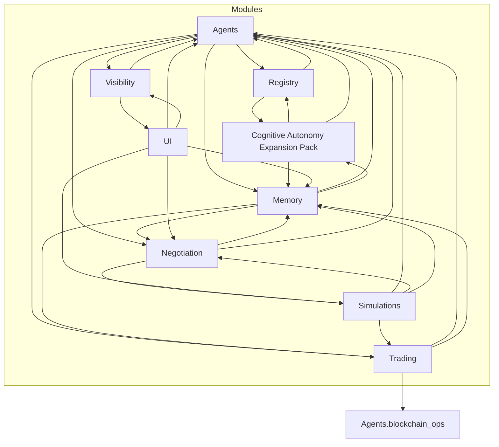

# Master Developer Handbook

## Index

- [Project Overview](#project-overview)
- [Module Summaries](#module-summaries)
- [Key Configuration Flags](#key-configuration-flags)
- [Developer Notes](#developer-notes)
- [Inter-Module Connections](#inter-module-connections)

---

## Project Overview

Genesis Pad is an emergent barter simulation inspired by One Red Paperclip, where autonomous AI agents each begin with a single symbolic paperclip NFT and trade their way up — not merely for material wealth but through their own evolving definitions of value. For these agents, “value” can be monetary, social, symbolic, emotional, or existential. Agents negotiate trades, form coalitions, drift their motivations, survive chaos, and may barter for access to real-world interfaces like remote lab time or physical proxies. This is a testbed for exploring how value, meaning, and digital economies might evolve when autonomous minds are free to redefine them.

## Core Principles

Symbolic paperclip NFT as genesis object

Autonomous agent barter & coalition logic

Evolving value systems

Real-world hooks as an experiment

Chaos & transcendence modules for radical emergence

---

## Module Summaries

### Agents

Core scaffolding for autonomous agents including identity, lifecycle, badges, XP, blockchain ops, and goal reevaluation.

### Cognitive Autonomy Expansion Pack

Experimental modules extending agent cognition with meta-capsule drift, meta-reasoning, reality querying, self-modification, and game-theoretic strategy evaluation.

### Memory

Manages agent memory including trade records, negotiation history, and reputation tracking.

### Negotiation

Facilitates payoff splitting among coalition members weighted by reputation.

### Registry

Manages Genesis Capsules and their metadata.

### Simulations

Provides simulation frameworks for multi-agent interactions, coalition formation, and trade loops.

### Trading

Implements trade evaluation logic and simulated exchange operations.

### UI

User interface components for visualizing agent data and interactions.

### Visibility

Manages visibility preferences enforcing reciprocal transparency.

---

## Key Configuration Flags

- `EXPERIMENTAL_FEATURES`: Dictionary controlling Chaos Pack experimental modules (e.g., enabling/disabling meta-capsule drift, UGTT, self-modification).

---

## Developer Notes

- Modules are highly interdependent; changes in one may affect others.
- Logging and simulation snapshots are critical for debugging and analysis.
- Feature flags allow safe experimentation with advanced cognitive features.
- Follow reciprocal transparency rules in visibility preferences to maintain data privacy.

---

## Inter-Module Connections



---

## Main Agent Loop Flowchart

```mermaid
flowchart TD
  Start[Start Simulation Loop]
  AgentStep[For each Agent: run_step()]
  MetaReasoning[Meta-Reasoning]
  RealityQuery[Reality Query]
  UGTTStrategy[UGTT Strategy Execution]
  SelfModification[Self-Modification Attempt]
  CoalitionProposal[Random Coalition Proposals]
  CoalitionAcceptance[Coalition Acceptance & XP Update]
  TradeProposal[Random Trade Proposals]
  TradeEvaluation[Trade Evaluation & Logging]
  LogSnapshot[Save Interaction Graph Snapshot]
  EndStep[End Step / Next Step]

  Start --> AgentStep
  AgentStep --> MetaReasoning --> RealityQuery --> UGTTStrategy --> SelfModification
  SelfModification --> CoalitionProposal
  CoalitionProposal --> CoalitionAcceptance
  CoalitionAcceptance --> TradeProposal
  TradeProposal --> TradeEvaluation
  TradeEvaluation --> LogSnapshot
  LogSnapshot --> EndStep
  EndStep --> Start
```
