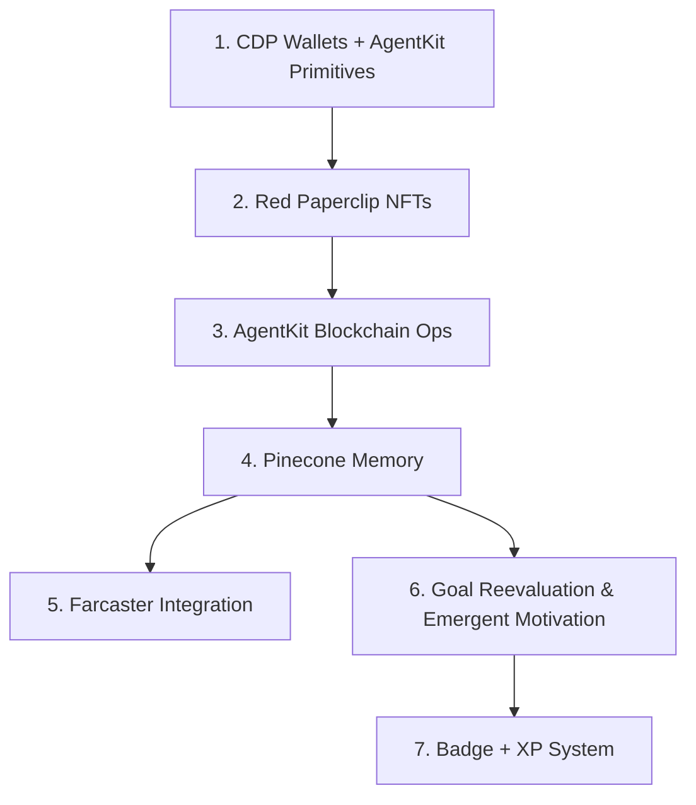
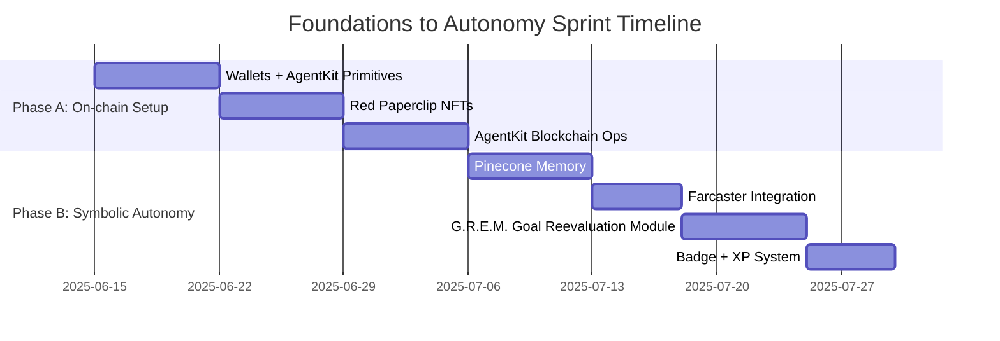

# Foundations to Autonomy Sprint Plan for Genesis Pad Simulation

## Overview

This sprint focuses on enabling on-chain identity, memory, symbolic reasoning, and meaningful autonomy for trading agents in the Genesis Pad simulation. The work is organized into seven distinct integration modules, each implemented as modular, testable Python files. The modules integrate with existing Genesis Capsule, AgentMemory, and TradeEvaluator logic, with clear dependencies and a phased rollout plan.

---

## Modules and Integration Points

### 1. CDP Wallets + AgentKit Primitives

- **Purpose:** Enable wallet creation and management for agents using AgentKit primitives.
- **Key Components:**
  - `WalletManager` class to create and store wallet addresses.
  - Use `wallets.create()` from AgentKit (stubbed in current implementation).
  - Store wallet address in the Genesis Capsule.
  - Scaffold test mode with Base Sepolia network.
- **Integration:** CapsuleRegistry to store wallet addresses; WalletManager used by agents.
- **Dependencies:** None (base module).
- **Testing:** Unit tests for wallet creation and address storage; integration tests with capsule updates.

### 2. Red Paperclip NFTs (Live Minting)

- **Purpose:** Mint soulbound Red Paperclip NFTs and assign to wallets.
- **Key Components:**
  - `RedPaperclipNFT` schema defining soulbound NFT attributes.
  - `NFTAssignmentManager` to assign NFTs to wallet addresses.
  - Store NFT metadata in agent capsule.
- **Integration:** Depends on wallet addresses from WalletManager.
- **Dependencies:** Module 1 (Wallets).
- **Testing:** Unit tests for NFT assignment logic; mock minting simulation.

### 3. AgentKit Blockchain Ops

- **Purpose:** Simulate symbolic on-chain consequences for trades.
- **Key Components:**
  - Blockchain operation simulation functions.
  - Log blockchain ops as memory events in AgentMemory.
  - Support symbolic metadata tags (e.g., "sacrifice", "strategic risk") tied to capsule values.
- **Integration:** TradeEvaluator to trigger blockchain ops; AgentMemory to log events.
- **Dependencies:** Modules 1 and 2 (wallets and NFTs).
- **Testing:** Simulation tests for blockchain ops; memory event logging verification.

### 4. Pinecone Memory (Per-Agent)

- **Purpose:** Provide per-agent memory namespace for indexing trade reflection metadata.
- **Key Components:**
  - Abstracted Pinecone client interface (simulated).
  - Index trade reflection metadata.
  - Support contextual recall for agents.
- **Integration:** AgentMemory extended with Pinecone indexing.
- **Dependencies:** Modules 1-3 (wallets, NFTs, blockchain ops).
- **Testing:** Simulated indexing and recall tests.

### 5. Farcaster Integration (or Simulated Broadcast)

- **Purpose:** Scaffold `broadcast_to_public()` method for publishing trade reflections or goal shifts.
- **Key Components:**
  - Broadcast method respecting visibility settings.
  - Simulated broadcast for development.
  - Reference agent public personas from Snapshot Panel in broadcasts for continuity.
- **Integration:** CapsuleRegistry for public snippets; visibility preferences.
- **Dependencies:** Modules 1-4.
- **Testing:** Broadcast simulation tests; visibility enforcement tests.

### 6. G.R.E.M. Goal Reevaluation Module (Goal Reevaluation & Emergent Motivation)

- **Purpose:** Periodically re-assess agent goals, tags, and motivation scores.
- **Key Components:**
  - Reevaluation scheduler.
  - Internal reasoning logs.
  - Updates to Genesis Capsule.
- **Integration:** CapsuleRegistry updates; AgentMemory for reasoning logs.
- **Dependencies:** Modules 1-4.
- **Testing:** Periodic reevaluation tests; capsule update verification.

### 7. Badge + XP System

- **Purpose:** Enable LLM-generated badge naming and attribution; track symbolic milestones.
- **Key Components:**
  - Badge generation logic.
  - XP tracking per agent.
  - Placeholder-ready visualization for UI rendering in Phase 4.
- **Integration:** CapsuleRegistry for badge data; UI modules for visualization.
- **Dependencies:** Modules 4 and 6 (memory and G.R.E.M.).
- **Testing:** Badge assignment tests; XP accumulation tests; UI integration tests.

---

## Module Dependency Graph

---

## Phased Execution Timeline

### Phase A: On-chain Setup

- Duration: Weeks 1-3
- Focus: Wallet creation, NFT minting, blockchain ops simulation.
- Modules: 1 (Wallets), 2 (NFTs), 3 (Blockchain Ops).

### Phase B: Symbolic Autonomy

- Duration: Weeks 4-6
- Focus: Memory indexing, broadcast simulation, goal reevaluation, badge/XP system.
- Modules: 4 (Pinecone Memory), 5 (Broadcast), 6 (G.R.E.M.), 7 (Badge + XP).

---

## Gantt Chart

---

## Testing Strategy

- Each module will have unit tests for core functionality.
- Integration tests will verify inter-module data flow and dependencies.
- Simulations and mocks will be used for blockchain, Pinecone, and broadcast integrations.
- Continuous integration pipeline to run tests on each commit.

---

## Summary

This plan provides a modular, phased approach to implement the Foundations to Autonomy sprint. It ensures clear dependencies, testability, and integration with existing Genesis Pad components. The phased timeline and visual diagrams support effective rollout and tracking.

Please review this plan and let me know if you would like any changes or additions. Once approved, I can assist with mode switching for implementation.
