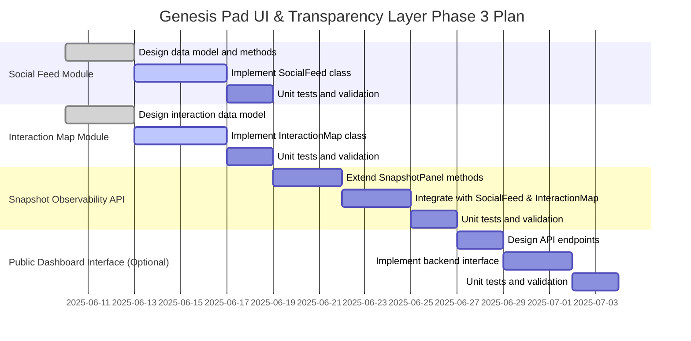

# Genesis Pad UI & Transparency Layer Sprint - Phase 3 Planning Document

## Objective

Build the public visibility and social observability infrastructure for Genesis Pad focusing on backend data management and API access for simulated agents. No frontend rendering or UI logic in this phase.

## Proposed File/Module Structure

```
ui/
├── social_feed.py          # Stores agent-authored public posts, event logs, trade reflections
├── interaction_map.py      # Tracks agent-to-agent interactions and models relationship links
├── snapshot_panel.py       # Existing: Agent snapshot data querying and visibility preferences
└── public_dashboard.py     # Backend interface exposing API endpoints for public data access (optional)
```

## Component Details

### 1. ui/social_feed.py

**Purpose:**  
Store and manage public posts, event logs, and trade reflections authored by agents.

**Key Classes & Methods:**

- `class SocialFeed:`
  - `append_post(agent_id: str, content: str, mood: Optional[str] = None, timestamp: Optional[datetime] = None) -> None`
  - `append_event_log(agent_id: str, event: str, timestamp: Optional[datetime] = None) -> None`
  - `append_trade_reflection(agent_id: str, trade_summary: str, timestamp: Optional[datetime] = None) -> None`
  - `get_recent_entries(limit: int = 50) -> List[Dict]`
  - `get_entries_by_agent(agent_id: str, limit: int = 20) -> List[Dict]`

**Data Model:**  
Each feed entry includes:

- `agent_id` (str)
- `content` (str)
- `type` (post, event_log, trade_reflection)
- `timestamp` (datetime)
- `mood` (optional str)

### 2. ui/interaction_map.py

**Purpose:**  
Track agent-to-agent interactions such as trades, public queries, and shared visibility moments. Model relationship links for future social graph visualization.

**Key Classes & Methods:**

- `class InteractionMap:`
  - `record_interaction(agent_a: str, agent_b: str, interaction_type: str, timestamp: Optional[datetime] = None) -> None`
  - `get_interactions(agent_id: str, limit: int = 50) -> List[Dict]`
  - `get_relationship_links() -> Dict[str, List[str]]`
  - `summarize_interactions(agent_id: str) -> Dict`

**Data Model:**  
Each interaction includes:

- `agent_a` (str)
- `agent_b` (str)
- `interaction_type` (str, e.g., trade, query, visibility_share)
- `timestamp` (datetime)

### 3. Snapshot Observability API (Extension of `ui/snapshot_panel.py`)

**Purpose:**  
Provide programmatic methods for agents to query their own visibility state and summarize other agents’ publicly shared data.

**Key Methods to Add:**

- `get_agent_snapshot(agent_id: str) -> Dict`
- `query_visibility_state(agent_id: str) -> Dict`
- `summarize_public_data(agent_id: str) -> Dict`

### 4. Optional Backend `public_dashboard.py`

**Purpose:**  
Bundle the above components into a backend interface exposing API endpoints for external or simulated agent access.

**Proposed Endpoints:**

- `/snapshot/{agent_id}`
- `/feed`
- `/feed/{agent_id}`
- `/interaction_map`
- `/interaction_map/{agent_id}`

**Implementation:**  
Use a lightweight API framework or function-call interface for simulated agents. No frontend rendering; data returned as structured JSON-like dicts.

## Phased Implementation Timeline



## Summary Diagram

```mermaid
graph TD
    A[Simulated Agents] -->|Function Calls| B[Public Dashboard API]
    B --> C[SocialFeed Module]
    B --> D[InteractionMap Module]
    B --> E[Snapshot Observability API (SnapshotPanel)]
    C --> F[Public Posts, Event Logs, Trade Reflections]
    D --> G[Agent-to-Agent Interaction Records]
    E --> H[Agent Visibility State & Public Data Summary]
```

---

Please review this plan and confirm if you would like me to proceed with implementation or make any adjustments.
