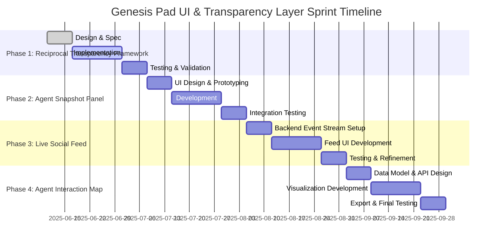

# Genesis Pad Simulation: UI & Transparency Layer Sprint Planning Document

## 1. Introduction

This document outlines the detailed plan for the UI & Transparency Layer Sprint in the Genesis Pad autonomous agent simulation. The sprint aims to enhance agent visibility controls, introduce new UI components for agent data presentation, and provide real-time social and interaction visualizations. The design emphasizes modularity, phased implementation, and compatibility with LLM-generated agent data.

---

## 2. Reciprocal Transparency Framework

### Objectives

- Implement fine-grained per-agent visibility flags controlling what data is shared and viewed.
- Enforce reciprocal sharing logic: an agent can only view another agent’s data in a category if they have shared their own data in that category.
- Track visibility preference changes with logs and timestamps.
- Provide clear interfaces for updating preferences, querying allowed data, and checking access eligibility.

### Visibility Flags (per agent)

- `show_goal`
- `show_badges`
- `show_emotional_arc`
- `show_public_snippet`
- `show_social_links`
- `show_trade_history`

### Core Features

- **Reciprocal Logic:**  
  For each visibility category, Agent A can view Agent B’s data only if Agent A has enabled sharing of that category themselves.
- **Internal Tracking:**  
  Maintain change logs with timestamps for all visibility preference updates.
- **Interfaces:**
  - Update visibility preferences (per category).
  - Query visibility-allowed data for a given agent pair.
  - Check access eligibility for a specific data category between two agents.

---

## 3. Agent Snapshot Panel (UI Scaffolding)

### Objectives

- Create a modular UI panel to display key agent information and visibility controls.
- Support dynamic updates based on agent data and visibility settings.

### Panel Components

- **Agent Nickname:** Display agent’s chosen name.
- **Public Snippet:** Show a short public text snippet if shared.
- **Top Badge / Status Icon:** Highlight the most significant badge or status.
- **Mood / State Indicator:** Display current mood or state, generated by LLM.
- **Shared Attributes Summary:** Compact view of shared data categories.
- **Visibility Preference Toggles:** UI controls to enable/disable sharing per category.

### Design Notes

- Modular components to allow easy extension or replacement.
- Responsive layout for integration into various UI contexts.
- Accessibility considerations for clear visibility state indication.

---

## 4. Live Social Feed

### Objectives

- Provide a real-time feed of social and agent events relevant to shared data.
- Enable users to observe dynamic agent interactions and state changes.

### Feed Content

- New badges awarded to agents.
- Public snippets posted or updated.
- Goal reevaluation events (if shared).
- Public trade memory entries.

### Implementation Notes

- Event-driven updates to feed.
- Filtering based on visibility permissions.
- Support for chronological ordering and event grouping.

---

## 5. Agent Interaction Map

### Objectives

- Visualize agent interactions and relationships through a graph-based UI.
- Represent trade events, social mentions, badge attributions, and metadata-driven indicators.

### Visualization Elements

- **Nodes:** Agents.
- **Edges:**
  - Trade events (directional).
  - Social mentions or replies (conditional on sharing).
  - Badge attribution links (e.g., “influenced by…”).
- **Indicators:** Optional overlays for trust, alignment, sentiment derived from agent metadata.

### Design Notes

- Use force-directed or similar graph layout for clarity.
- Interactive elements to explore agent details and relationships.
- Exportable to markdown logs or web-renderable formats for human review.

---

## 6. Constraints & Notes

- **Modular Design:**  
  All UI and logic layers must be loosely coupled with core agent modules to allow independent development and testing.
- **Phased Implementation:**  
  Support incremental rollout, e.g., build Live Social Feed first, then Agent Interaction Map.
- **Visualization Export:**  
  Visualizations must be exportable to markdown or web formats for external observation and analysis.
- **LLM Compatibility:**  
  Designed to work with LLM-generated text and motivations, not limited to numeric-only agents.

---

## 7. High-Level Timeline & Phases

---

## 8. Summary

This sprint plan provides a clear roadmap to implement a robust UI and transparency layer for the Genesis Pad simulation. It balances modularity, phased delivery, and rich visualization capabilities while respecting agent privacy and reciprocal sharing principles. The plan is designed to guide development teams through design, implementation, and testing phases efficiently.

---

_End of Document_
