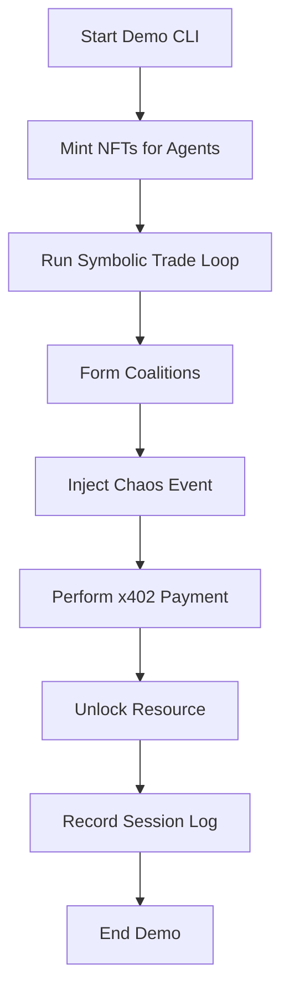
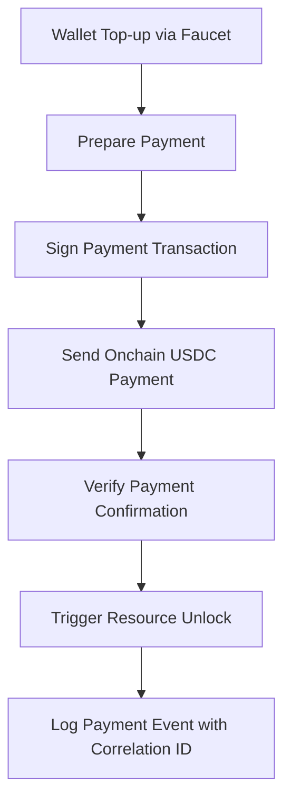

# Genesis Pad Hackathon Execution Plan

## 1. Overview

This execution plan finalizes the approach for the Genesis Pad hackathon, building on the initial sprint plan. The goal is to deliver a proof-of-concept demonstrating:

- On-chain autonomous agent trading with CDP wallets
- x402 payment flow using live testnet funds with full verification
- NFT metadata storage via Pinata with fallback mocks
- AWS backend API and dashboard showcasing live simulation data
- A scripted multi-agent demo scenario including chaos events, coalition formation, symbolic trade loops, and resource unlocking via payments
- Comprehensive logging and session recording for submission

---

## 2. Module Breakdown

### 2.1 x402 Payments

- Use live testnet funds on Base Sepolia network (recommended)
- Implement a simple faucet script or provide clear faucet usage instructions in the README to enable automatic wallet top-ups during the demo
- Demonstrate an actual onchain USDC payment with full verification integrated into the flow
- Log payment events with timestamp, agent_id, event_type, and correlation_id for traceability

### 2.2 Pinata NFT Metadata Storage

- Use existing `PINATA_JWT` from `.env`; no additional keys required
- Implement fallback mocks controlled by a flag `USE_PINATA_MOCK=true` to enable development without live Pinata access

### 2.3 AWS Backend API / Dashboard

- Keep REST API endpoints open/public for the hackathon duration to simplify access
- Add a README note with a placeholder for future JWT-based authentication to harden security post-hackathon
- API endpoints include `/agents`, `/trades`, `/coalitions`, and `/payments` returning JSON data matching simulation snapshots

### 2.4 Demo Scenario & Automation

- CLI demo script (`python run_hackathon_demo.py`) includes:
  - Chaos event injection to simulate disruptions
  - Coalition formation among agents
  - Symbolic trade loop demonstrating agent interactions
  - x402 payment unlocking a resource within the scenario
- Session log records:
  - Timestamps
  - Agent IDs
  - Coalition IDs
  - Correlation IDs for payments
  - Event types
- The log is output as a valid JSON file suitable for submission

### 2.5 Documentation & Deliverables

- Update root `README.md` with:
  - Hackathon setup instructions
  - Environment variable descriptions (`CDP_API_KEY_NAME`, `PINATA_JWT`, `USE_PINATA_MOCK`, etc.)
  - API usage examples
  - Demo flowcharts and screenshots for judges

---

## 3. Dependencies

| Module               | Depends On                                    |
| -------------------- | --------------------------------------------- |
| x402 Payment Handler | WalletManager, AgentKit                       |
| Pinata Integration   | Capsule Registry                              |
| AWS Backend API      | Simulation logs, data structures              |
| Demo Scenario        | All above modules + chaos, coalition features |
| Documentation        | All module implementations                    |

---

## 4. Proposed Folder Layout

```
/payments/x402_payment_handler.py
/api/premium_data.py
/demos/run_hackathon_demo.py
/tests/test_x402_payment.py
/tests/test_pinata_integration.py
/tests/test_aws_api.py
```

---

## 5. Implementation Sequence

| Step | Task                                                          | Duration |
| ---- | ------------------------------------------------------------- | -------- |
| 1    | Implement x402 Payment Handler and faucet script/instructions | 2 days   |
| 2    | Integrate Pinata NFT metadata storage with mock fallback      | 1.5 days |
| 3    | Develop AWS backend API and dashboard endpoints               | 2 days   |
| 4    | Script demo scenario and CLI automation                       | 1.5 days |
| 5    | Update documentation with setup, usage, and flowcharts        | 1 day    |
| 6    | Conduct unit and integration testing throughout               | Ongoing  |

---

## 6. Testing Strategy

- Unit tests for:
  - x402 payment parsing, signing, retry logic
  - Pinata API calls and fallback behavior
- Integration tests for:
  - Full payment flow and API responses
  - Demo scenario event generation and log consistency
- Manual verification of dashboard and API endpoints

---

## 7. Acceptance Criteria

- All logs include:
  - `timestamp`
  - `agent_id`
  - `event_type`
  - `correlation_id` (for x402 payments)
- Full demo runs without errors
- Generates a valid JSON session log suitable for submission

---

## 8. Environment Configuration

| Variable                                               | Description                                             | Required    |
| ------------------------------------------------------ | ------------------------------------------------------- | ----------- |
| `PINATA_JWT`                                           | JWT token for Pinata API access                         | Yes         |
| `USE_PINATA_MOCK`                                      | Flag to enable Pinata mock fallback (`true` or `false`) | Yes         |
| `CDP_API_KEY_NAME`                                     | API key name for CDP wallet integration                 | Yes         |
| `FAUCET_SCRIPT`                                        | Path or instructions for faucet top-ups                 | Recommended |
| Other relevant env vars as needed for AWS API and demo |

---

## 9. Mermaid Diagrams

### 9.1 Demo Scenario Flow



### 9.2 x402 Payment Flow



---

This completes the detailed hackathon execution plan incorporating all clarifications and upgrades. Please review and let me know if you would like any changes or additions before I write the full markdown file.
